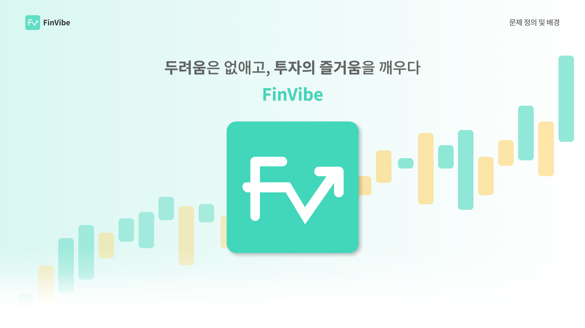
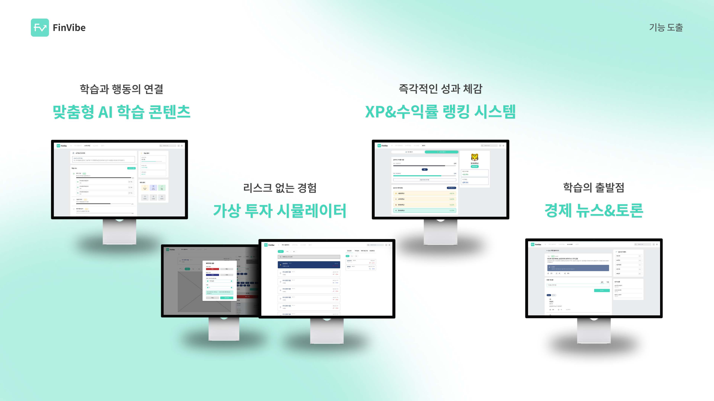
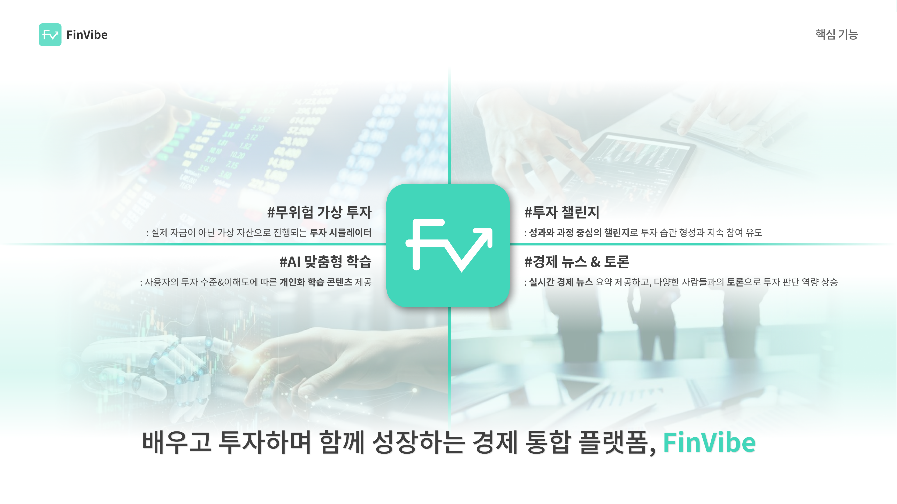
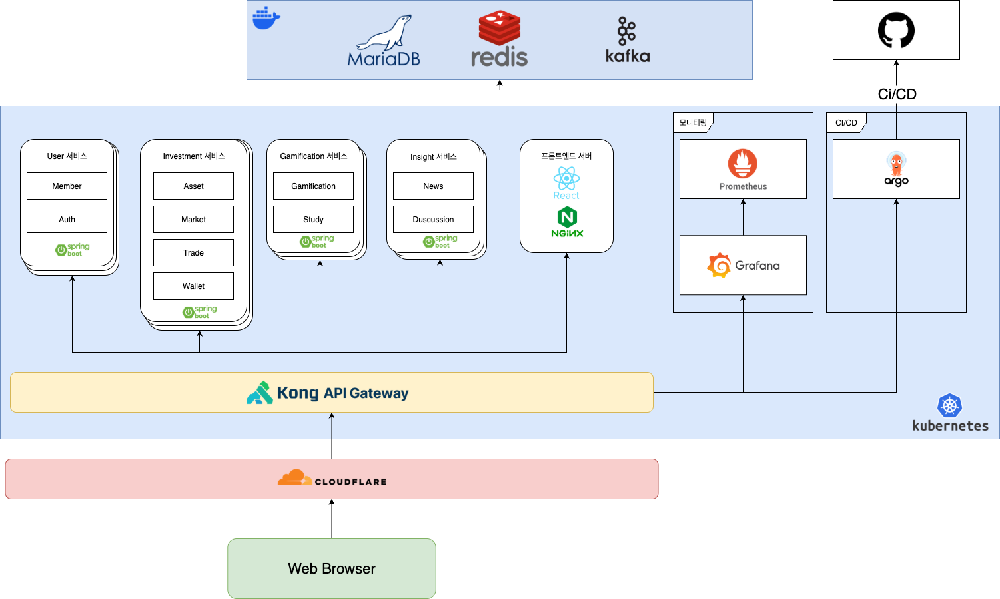

# Finvibe
> 모의 투자 및 경제 학습 플랫폼

# 기술 스택
## 프론트엔드

## 백엔드

## 아키텍처

# 프로젝트 구조
본 레포지토리는 ArgoCD와의 연동을 위한 레포지토리입니다.

백엔드는 총 4가지 레포지토리로 구성되어 있습니다.
- 유저 서비스 : ([바로가기](https://github.com/DEPth-FinVibe/Finvibe_Backend_User))
- 투자 서비스 : ([바로가기](https://github.com/DEPth-FinVibe/Finvibe_Backend_Investment))
- 게이미피케이션 서비스 : ([바로가기](https://github.com/DEPth-FinVibe/Finvibe_Backend_Gamification))
- 인사이트 서비스 : ([바로가기](https://github.com/DEPth-FinVibe/Finvibe_Backend_Insight))