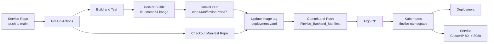
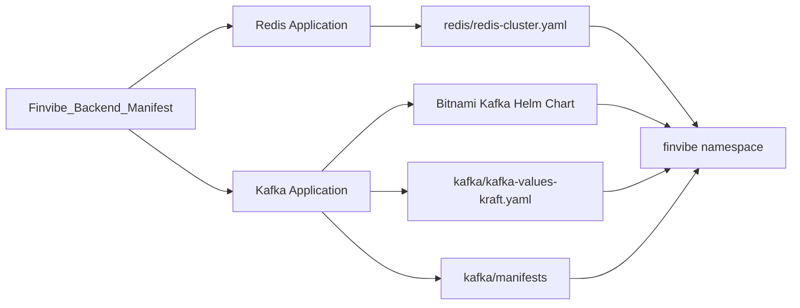

# Deployment Flow

## Overview

## Service Mapping

| Service repo | Docker image | Manifest path |
| --- | --- | --- |
| `Finvibe_Backend_Monolith` | `cmh1448/finvibe-monolith:sha7` | `backend/deployment.yaml` |
| `Finvibe_Backend_Batch` | `cmh1448/finvibe-backend-batch:sha7` | `batch/deployment.yaml` |
| `Finvibe-Websocket-Listener-main` | `cmh1448/finvibe-websocket-listener:sha7` | `websocket-listener/deployment.yaml` |
| `Finvibe_Profit_Worker` | `cmh1448/finvibe-profit-worker:sha7` | `profit-worker/deployment.yaml` |
| `Finvibe_Profit_Worker_Webflux` | `cmh1448/finvibe-profit-worker-webflux:sha7` | `profit-worker-webflux/deployment.yaml` |
| `Finvibe_Profit_Worker_Golang` | `cmh1448/finvibe-profit-worker-golang:sha7` | `profit-worker-golang/deployment.yaml` |

## Infra Managed By Argo CD

## Notes

- 배포는 서비스 레포의 `main` 브랜치 push에서 시작된다.
- 이미지 태그는 GitHub commit SHA 앞 7자리다.
- CI가 manifest 레포의 각 `deployment.yaml` 이미지 태그를 수정하고 push한다.
- Redis와 Kafka는 이 manifest 레포에 Argo CD Application manifest가 있다.
- 서비스 Deployment를 추적하는 Argo CD Application manifest는 로컬 파일에서 확인되지 않았다.
