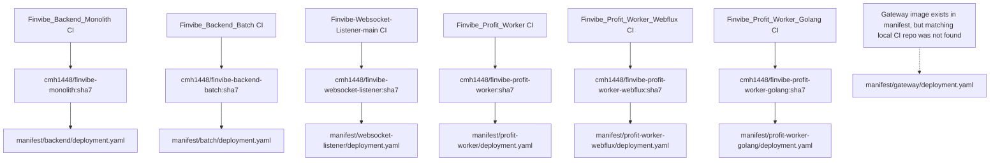
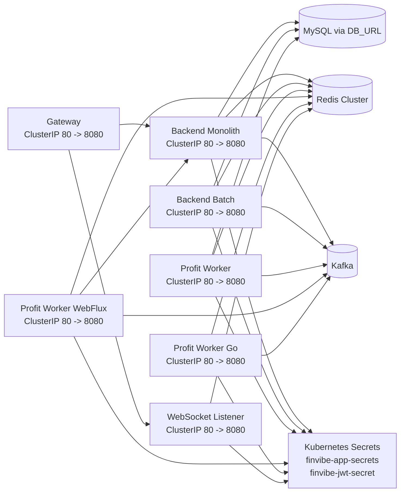
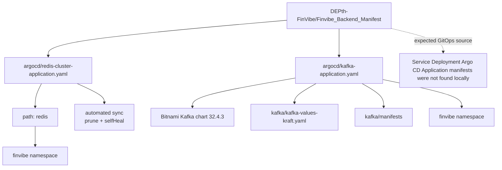

# Finvibe Deployment Flow

## CI/CD flow

```mermaid
flowchart LR
    dev[Developer pushes to service repo main]
    pr[Pull request to main/develop]

    subgraph service_ci[GitHub Actions in each service repo]
        checkout[Checkout service repo]
        build[Build and test]
        tag[Create image tag from GITHUB_SHA first 7 chars]
        docker[Build linux/amd64 Docker image]
        push[Push image to Docker Hub]
        manifest_checkout[Checkout DEPth-FinVibe/Finvibe_Backend_Manifest]
        update_manifest[Update service deployment.yaml image tag]
        commit_manifest[Commit and push manifest repo]
    end

    subgraph registry[Docker Hub]
        images[cmh1448/finvibe-*:sha7]
    end

    subgraph gitops[Manifest repo]
        deployments[service/deployment.yaml]
        services[service/service.yaml]
        infra[redis and kafka Argo CD applications]
    end

    subgraph cluster[Kubernetes cluster: finvibe namespace]
        argocd[Argo CD]
        workloads[Deployments and Services]
        redis[Redis Cluster]
        kafka[Kafka KRaft]
    end

    pr --> checkout --> build
    build -. PR stops before deploy .-> pr_done[CI check result]

    dev --> checkout --> build --> tag --> docker --> push --> images
    push --> manifest_checkout --> update_manifest --> commit_manifest --> deployments
    deployments --> argocd
    services --> argocd
    infra --> argocd
    argocd --> workloads
    argocd --> redis
    argocd --> kafka
    workloads --> images
```

## Service image update map

## Runtime topology from manifests

## Argo CD resources confirmed in this repo

## Notes

- Service CI workflows deploy only on `push` to `main`.
- `pull_request` workflows for Batch, Profit Worker, Profit Worker WebFlux, and Profit Worker Go stop at build/test and do not push images or update manifests.
- Image tags are the first 7 characters of `GITHUB_SHA`.
- Application service manifests define `Deployment` plus `ClusterIP` `Service` resources with port `80` targeting container port `8080`.
- Redis and Kafka are explicitly represented as Argo CD applications in this repo. Service-level Argo CD `Application` manifests were not present in the checked files.
